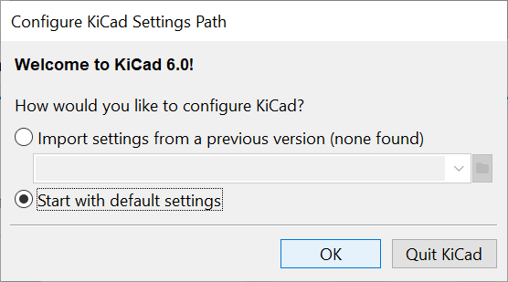

# KiCad   
1. We will be designing a Raspberry Pi Interface board using KiCad.
2. Chapter 18 of the below textbook on pages 259-284, pages 268-293 of the pdf, has Project 2: Design a small Raspberry Pi HAT.
   Dalmaris, P. (2018). KiCad Like a Pro 2nd edition. United Kingdom: Elektor International Media B.V. Tech Explorations: EBOOK SOLO 978-1-64440-886-5. Note that newer versions of the textbook do not include this project.   
3. Launch KiCad:   

2. Start with default settings:   

3. I have followed [Using a template](https://techexplorations.com/guides/kicad/3e/create-a-new-kicad-project-from-a-template/)https://techexplorations.com/guides/kicad/3e/create-a-new-kicad-project-from-a-template/ and [Vlad's guide to PCB facilities in J233](PCBPrototypes.md) to a certain extent in order to create:
